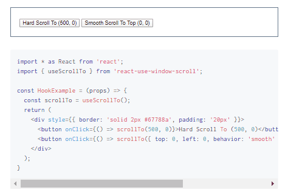

<h2 align="center">
  <a href="https://github.com/justinmahar/react-use-window-scroll">React Use Window Scroll</a>
</h2>
<h3 align="center">
  React hooks for scrolling the page to any location, or by any amount.<br/>Supports smooth scrolling.
</h3>
<p align="center">
  <a href="https://badge.fury.io/js/react-use-window-scroll">
    
  </a>
  <a href="https://github.com/justinmahar/react-use-window-scroll/actions?query=workflow%3ATests">
    
  </a>
  <a href="https://github.com/justinmahar/react-use-window-scroll/actions?query=workflow%3ADeploy">
    
  </a>
</p>

## Documentation

Read the **[official documentation](https://justinmahar.github.io/react-use-window-scroll/)**.

[](https://justinmahar.github.io/react-use-window-scroll/useScrollTo#hook-example)

👁️ **[Live Demo](https://justinmahar.github.io/react-use-window-scroll/useScrollTo#hook-example)**

## Overview

This package includes two hooks for scrolling the page to any coordinates, or by any amount. They both use the the [Window Web API](https://developer.mozilla.org/en-US/docs/Web/API/Window)'s scroll functions and support using [ScrollToOptions](https://developer.mozilla.org/en-US/docs/Web/API/ScrollToOptions) for smooth scrolling implemented natively by the browser.

- [useScrollBy](https://justinmahar.github.io/react-use-window-scroll/useScrollBy) - Returns a function to scroll the page up or down by any amount, in pixels. Supports smooth scrolling.
- [useScrollTo](https://justinmahar.github.io/react-use-window-scroll/useScrollTo) - Returns a function to scroll the page to any page coordinates, in pixels. Supports smooth scrolling.

Click either of those to see a live demo (at bottom of page).

### Features include:

- **🎯 Scroll the page to any pixel coordinates, or by any pixel amount**
  - Easily send your viewer to any location on the page. Great for scrolling to the top on first render, or smoothly sending to the top when reaching the bottom.
- **😎 Native smooth scrolling support**
  - Supports browser-native smooth scrolling by specifying [ScrollToOptions](https://developer.mozilla.org/en-US/docs/Web/API/ScrollToOptions).
- **🧮 Legacy browser support**
  - Includes polyfill to support browsers that lack native smooth scrolling support (I'm looking at you, Safari!)
- **🤏 Low overhead**
  - Uses browser-provided [Window.scrollTo](https://developer.mozilla.org/en-US/docs/Web/API/Window/scrollTo) and [Window.scrollBy](https://developer.mozilla.org/en-US/docs/Web/API/Window/scrollBy) functions only—even for smooth scrolling.
- **🛡️ Safely access the [Window Web API](https://developer.mozilla.org/en-US/docs/Web/API/Window)**
  - Accessing `window` haphazardly in React is considered sloppy. These hooks follow the React paradigm of containing side-effects.

## Installation

```
npm i react-use-window-scroll
```

## Quick Start

### useScrollBy

```jsx
import * as React from "react";
import { useScrollBy } from "react-use-window-scroll";

const HookExample = () => {
  const scrollBy = useScrollBy();
  return (
    <div>
      {/* Hard scroll down by 200 pixels */}
      <button onClick={() => scrollBy(200, 0)}>Hard Scroll By 200</button>
      {/* Smooth scroll down by 200 pixels */}
      <button
        onClick={() => scrollBy({ top: 200, left: 0, behavior: "smooth" })}
      >
        Smooth Scroll By 200
      </button> ...
    </div>
  );
};
```

Read full [useScrollBy docs](https://justinmahar.github.io/react-use-window-scroll/useScrollBy).

### useScrollTo

```jsx
import { useScrollTo } from "react-use-window-scroll";

const HookExample = () => {
  const scrollTo = useScrollTo();
  return (
    <div style={{ border: "solid 2px #67788a", padding: "20px" }}>
      {/* Hard scroll to the top */}
      <button onClick={() => scrollTo(0, 0)}>
        Hard Scroll To Top (0, 0)
      </button> {/* Smooth scroll to the top */}
      <button onClick={() => scrollTo({ top: 0, left: 0, behavior: "smooth" })}>
        Smooth Scroll To Top (0, 0)
      </button>
    </div>
  );
};
```

Read full [useScrollTo docs](https://justinmahar.github.io/react-use-window-scroll/useScrollTo).

## TypeScript

Type definitions have been included for [TypeScript](https://www.typescriptlang.org/) support.

## Logo Attribution

Logo graphics by [Twemoji](https://github.com/twitter/twemoji), licensed under [CC-BY 4.0](https://creativecommons.org/licenses/by/4.0/). Favicon by [favicon.io](https://favicon.io/emoji-favicons/).

## Contributing

Open source software is awesome and so are you. 😎

Feel free to submit a pull request for bugs or additions, and make sure to update tests as appropriate. If you find a mistake in the docs, send a PR! Even the smallest changes help.

For major changes, open an issue first to discuss what you'd like to change.

See [Kindling](https://tinyurl.com/kindlingscripts) for npm script documentation.

## ⭐ Found It Helpful? [Star It!](https://github.com/justinmahar/react-use-window-scroll/stargazers)

If you found this project helpful, let the community know by giving it a [star](https://github.com/justinmahar/react-use-window-scroll/stargazers): [👉⭐](https://github.com/justinmahar/react-use-window-scroll/stargazers)

## Logo Attribution

Logo graphics by [Twemoji](https://github.com/twitter/twemoji), licensed under [CC-BY 4.0](https://creativecommons.org/licenses/by/4.0/). Favicon by [favicon.io](https://favicon.io/emoji-favicons/).

## MIT License

```
Copyright © 2020 Justin Mahar https://github.com/justinmahar

Permission is hereby granted, free of charge, to any person obtaining a copy
of this software and associated documentation files (the "Software"), to deal
in the Software without restriction, including without limitation the rights
to use, copy, modify, merge, publish, distribute, sublicense, and/or sell
copies of the Software, and to permit persons to whom the Software is
furnished to do so, subject to the following conditions:

The above copyright notice and this permission notice shall be included in all
copies or substantial portions of the Software.

THE SOFTWARE IS PROVIDED "AS IS", WITHOUT WARRANTY OF ANY KIND, EXPRESS OR
IMPLIED, INCLUDING BUT NOT LIMITED TO THE WARRANTIES OF MERCHANTABILITY,
FITNESS FOR A PARTICULAR PURPOSE AND NONINFRINGEMENT. IN NO EVENT SHALL THE
AUTHORS OR COPYRIGHT HOLDERS BE LIABLE FOR ANY CLAIM, DAMAGES OR OTHER
LIABILITY, WHETHER IN AN ACTION OF CONTRACT, TORT OR OTHERWISE, ARISING FROM,
OUT OF OR IN CONNECTION WITH THE SOFTWARE OR THE USE OR OTHER DEALINGS IN THE
SOFTWARE.
```
